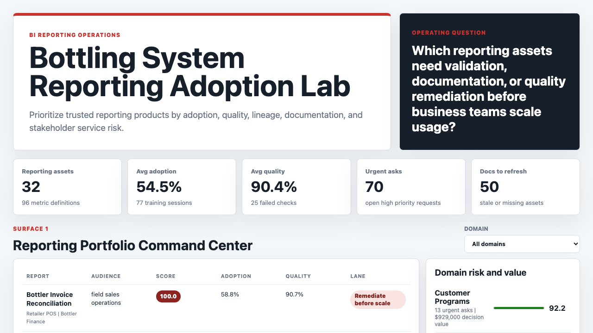
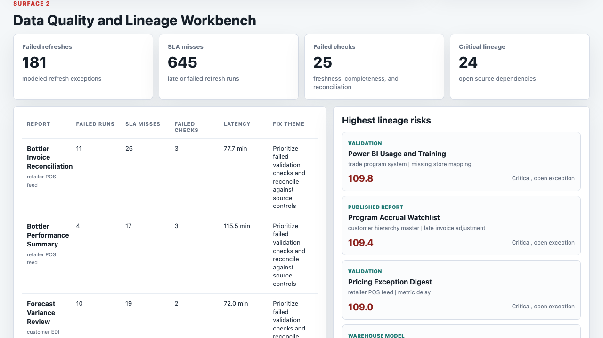
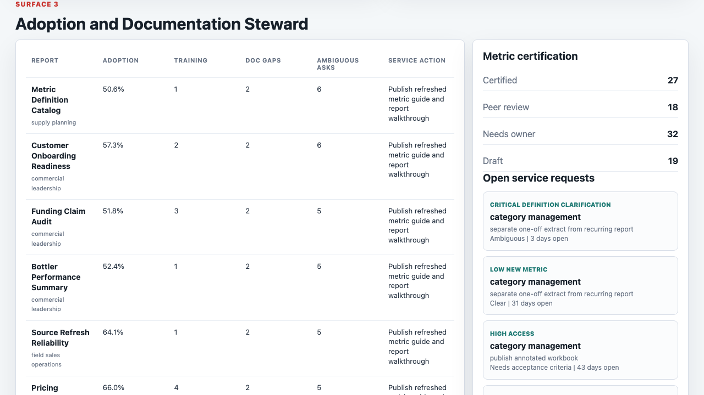

# Bottling System Reporting Adoption Lab

A portfolio artifact for a business intelligence analyst role supporting a complex beverage bottling and shared-services reporting environment. The project turns reporting assets, stakeholder requests, Power BI-style adoption signals, source refresh history, metric definitions, data quality checks, and lineage dependencies into a practical operating console.

The artifact is built around a real BI problem: business teams need reporting products that are accurate, logical, performant, documented, and adopted. The dashboard is only one layer. The stronger story is the evidence system behind it.

## Screenshots



**Reporting portfolio command center:** ranks reporting assets by decision value, adoption rate, quality score, refresh SLA misses, urgent stakeholder asks, documentation gaps, and source lineage exceptions.



**Data quality and lineage workbench:** shows failed refreshes, SLA misses, failed validation checks, source dependency risk, and the fix theme a BI analyst would bring into a reporting services review.



**Adoption and documentation steward:** connects report adoption, training sessions, stale documentation, ambiguous stakeholder requests, metric certification, and service actions.

## What This Project Demonstrates

- SQL-ready BI triage using joins, aggregations, source refresh outcomes, quality checks, and stakeholder request queues.
- Reporting stewardship across metric definitions, data lineage, documentation, training, adoption, and service follow-up.
- Power BI-style portfolio thinking, including semantic model readiness, refresh reliability, metric certification, and audience adoption.
- Clear communication of technical data risk in business terms.
- A practical prioritization model that is transparent enough to defend in an interview.

## Artifact Surfaces

1. **Reporting portfolio command center:** identifies which reporting products should be remediated, validated, or monitored.
2. **Data quality and lineage workbench:** investigates anomaly themes, failed checks, refresh problems, and source dependencies.
3. **Adoption and documentation steward:** turns training, documentation, and stakeholder asks into concrete reporting service actions.
4. **Evidence layer:** includes generated CSV outputs, SQL checks, Python scoring logic, a data dictionary, and written findings.

## Data Strategy

All data in this repository is synthetic and labeled as synthetic. It does not represent real company performance, real customers, real bottlers, real invoices, real point-of-sale feeds, or real employee activity.

Synthetic data is used because internal bottling-system reporting assets, retailer point-of-sale feeds, customer hierarchy records, EDI transactions, invoice-level sales, refresh logs, and stakeholder service requests are private. The generator uses a fixed random seed so the artifact is reproducible.

The synthetic data is modeled on common shared-services BI structures:

- Reporting products across customer programs, retailer POS, bottler invoice, distributor data, customer hierarchy, and FP&A planning domains.
- Power BI-style assets with workspace, audience, owner group, refresh cadence, source system, decision value, RLS need, and certification state.
- Daily adoption and quality signals for active users, target users, views, exports, render time, ticket count, refresh latency, and quality score.
- Refresh runs with status, duration, SLA state, rows processed, and failure reason.
- Data quality checks for freshness, completeness, uniqueness, referential integrity, metric reconciliation, and schema drift.
- Source lineage dependencies across landing, validation, warehouse model, semantic model, and published report stages.
- Stakeholder requests for data anomalies, new metrics, access, training, performance, definition clarification, and custom extracts.
- Documentation assets, training sessions, and metric definitions used to show whether a report is adopted and explainable.

Generated datasets:

| File | Grain | Purpose |
|---|---:|---|
| `data/entities.csv` | report asset | Report metadata, domain, audience, workspace, owner, source, decision value |
| `data/daily_metrics.csv` | report by day | Adoption, views, exports, quality score, latency, ticket volume |
| `data/refresh_runs.csv` | refresh run | Refresh status, SLA, duration, rows processed, failure reason |
| `data/quality_checks.csv` | validation check | Quality control results and recommended fixes |
| `data/lineage_map.csv` | report dependency | Source system, pipeline stage, dependency tier, owner, exception state |
| `data/metric_definitions.csv` | metric definition | Business definition, grain, certification, SQL coverage, owner |
| `data/stakeholder_requests.csv` | request | Stakeholder asks, priority, age, clarity, status, service action |
| `data/documentation_assets.csv` | documentation asset | Metric guides, refresh notes, review age, owner |
| `data/training_sessions.csv` | session | Audience training, attendance, satisfaction, adoption lift |
| `data/source_events.csv` | operating event | Reporting service events, severity, impact, resolution state |
| `data/recommended_actions.csv` | action | Candidate remediation and adoption actions |

Analysis outputs:

| File | Purpose |
|---|---|
| `analysis/outputs/priority_queue.csv` | Ranked reporting portfolio queue |
| `analysis/outputs/refresh_quality_summary.csv` | Refresh reliability and quality summary |
| `analysis/outputs/lineage_quality_queue.csv` | Source dependency and lineage risk queue |
| `analysis/outputs/adoption_documentation_queue.csv` | Adoption, documentation, training, and service action queue |
| `analysis/outputs/summary.json` | Summary metrics used by the browser UI |

## Scoring Method

The scoring model is intentionally explainable. It combines:

- Decision value.
- Quality gap against a 96 percent target.
- Failed validation checks and warning checks.
- Failed refreshes and refresh SLA misses.
- Adoption gap against a 78 percent target.
- Open urgent stakeholder requests.
- Ambiguous requirements.
- Stale or missing documentation.
- Uncertified metric definitions.
- Critical lineage exceptions.

The model assigns each report to one lane:

- `Remediate before scale`
- `Validate with stakeholders`
- `Publish and monitor`

## Power BI and SQL Evidence

- `analysis/sql_checks.sql` contains SQL patterns for portfolio priority, refresh reliability, quality checks, lineage exceptions, adoption gaps, and stakeholder request triage.
- `analysis/power_bi_measure_catalog.md` contains DAX-style measures for adoption, quality, refresh SLA, documentation coverage, and certification.
- `scripts/score_operating_data.py` creates the ranked output queues that feed the browser UI.

## Run Locally

```bash
npm run generate
npm run analyze
npm start
```

Then open `http://127.0.0.1:4273`.

## Role Fit

This artifact maps to a BI analyst role focused on SQL, Power BI reporting, data manipulation, relational data, reporting services, anomaly research, data quality, stakeholder training, documentation, and adoption. It shows how reporting products can be stewarded from source data through business-facing usage.

## Honest Scope

This project does:

- Provide a reproducible synthetic BI reporting operations lab.
- Include generated datasets, output queues, SQL evidence, Python scoring, and a working browser UI.
- Demonstrate how reporting quality, lineage, requirements, and adoption can be managed together.

This project does not:

- Use private or proprietary data.
- Claim to represent actual performance from any company or bottler.
- Publish a real Power BI workspace.
- Replace production governance, security, privacy, or finance controls.

## Repository Map

```text
data/                         Synthetic source and operating datasets
analysis/                     SQL checks, findings, measure catalog, generated outputs
scripts/generate_bi_data.py    Reproducible synthetic data generator
scripts/score_operating_data.py Explainable scoring and output generation
src/                          Browser UI JavaScript and CSS
docs/images/                  Screenshot evidence for artifact surfaces
```
